# Client Connect

Client Connect is a lightweight ASP.NET MVC 5 web application for managing clients and their contacts. It uses Entity Framework 6 for data access, DataTables for responsive tables, and SweetAlert2 for user-friendly dialogs.

## Features
- Create, edit and delete clients
- Link / unlink contacts to clients
- Client code auto-generation (alpha prefix + numeric sequence)
- DataTables-powered lists with server-side JSON endpoints
- Client and contact view models with server- and client-side validation

## Tech stack
- .NET Framework 4.7.2
- ASP.NET MVC 5
- Entity Framework 6
- Bootstrap 4, jQuery
- DataTables, SweetAlert2, FontAwesome

## Getting started

Prerequisites
- Visual Studio 2022
- .NET Framework 4.7.2
- SQL Server (Express or full)
- (Optional) Git and GitHub account

Setup
1. Clone the repository:
   git clone <repo-url>

2. Open the solution in Visual Studio 2022.

3. Restore NuGet packages (Visual Studio should do this automatically). If needed, open __Tools > NuGet Package Manager > Package Manager Console__ and run:
   Enable-Migrations    # (if you want to use EF migrations)
   Add-Migration Initial
   Update-Database

4. Configure database connection:
   - Edit the connection string named `ClientManagementDB` in `Client Connect\Web.config` to point to your SQL Server instance.

5. Build and run:
   - Rebuild solution via __Build > Rebuild Solution__
   - Start the app via __Debug > Start Debugging__ (F5) or IIS Express.

Notes
- The client code generation logic lives in `Client Connect\Services\ClientCodeService.cs`.
- If you do not want to use EF migrations, create the database schema manually to match the models or enable migrations and update the database as shown above.
- A .gitignore is included to exclude bin/obj, user files, and typical Visual Studio artifacts.


## 📸 Screenshots

### Home
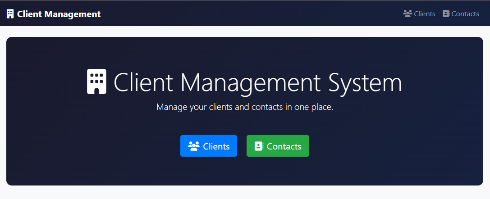

---

### Clients

#### Client List


#### Search
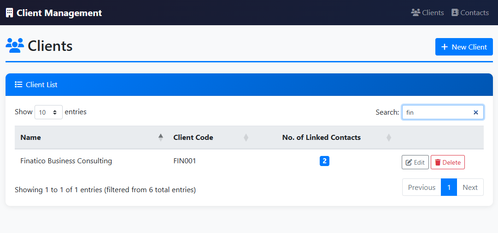

#### No Clients Found
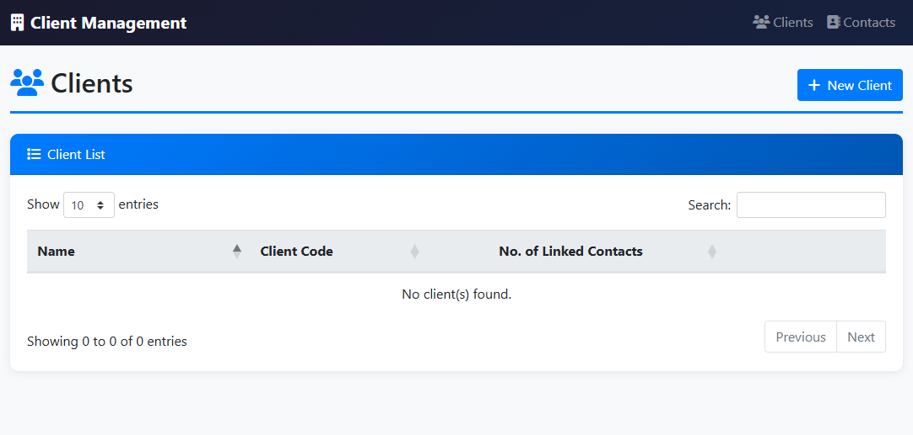

#### Create Client
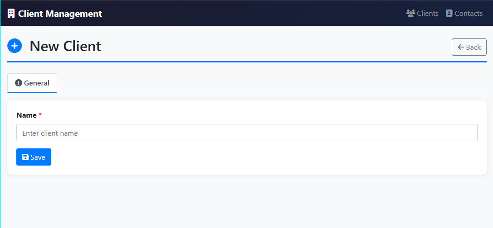

#### Client Created Successfully
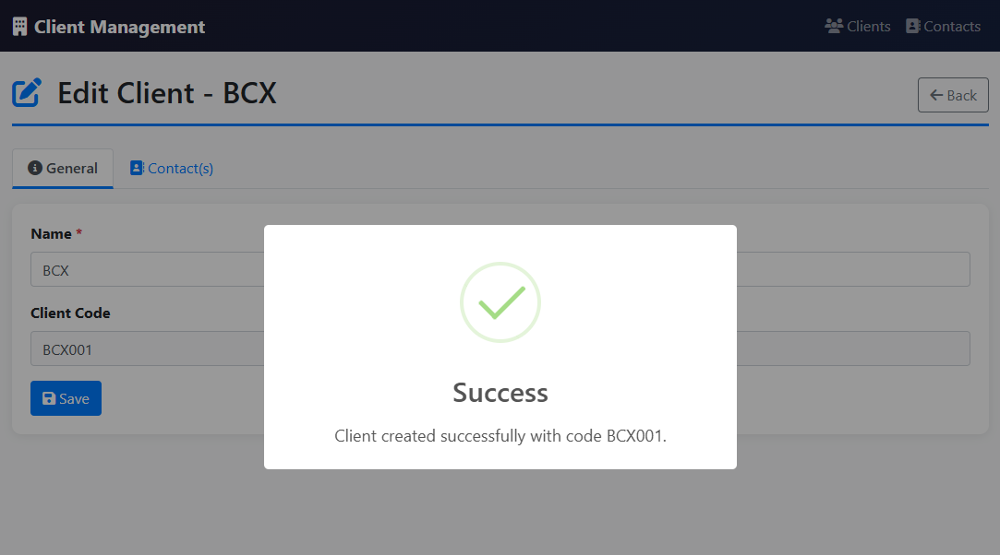

#### Edit Client — Contacts Tab (No Contacts Linked)
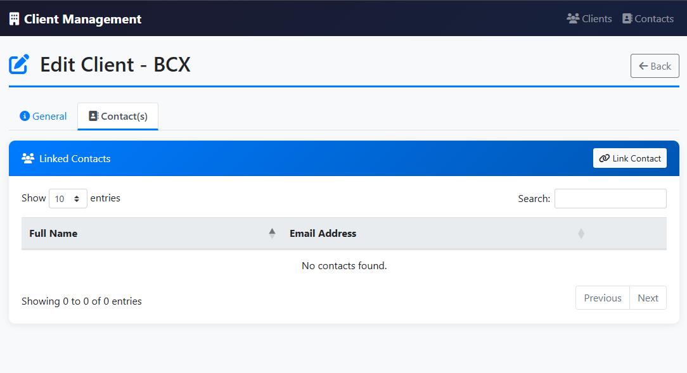

#### Delete Warning
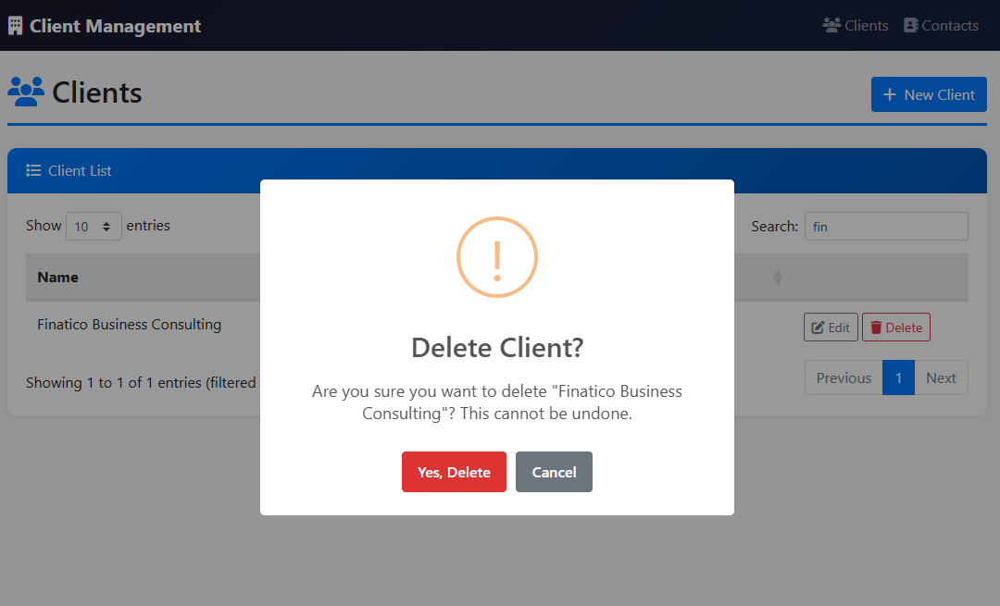

#### Delete Confirmation
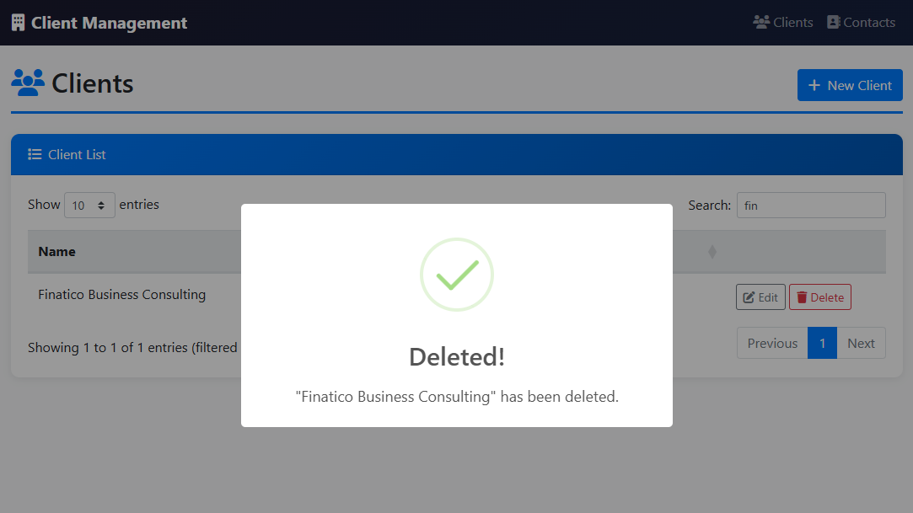

---

### Contacts

#### Contact List


#### No Contacts Found
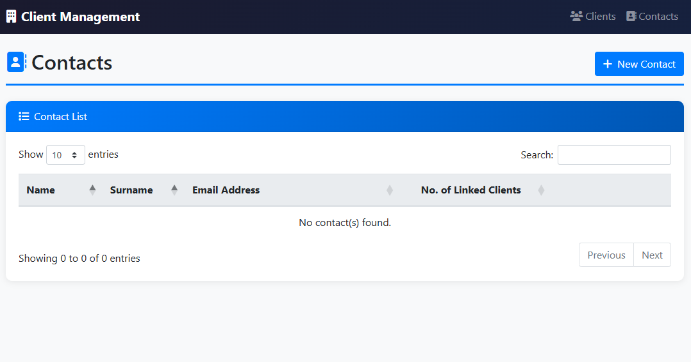

#### Create Contact


#### Validation Example
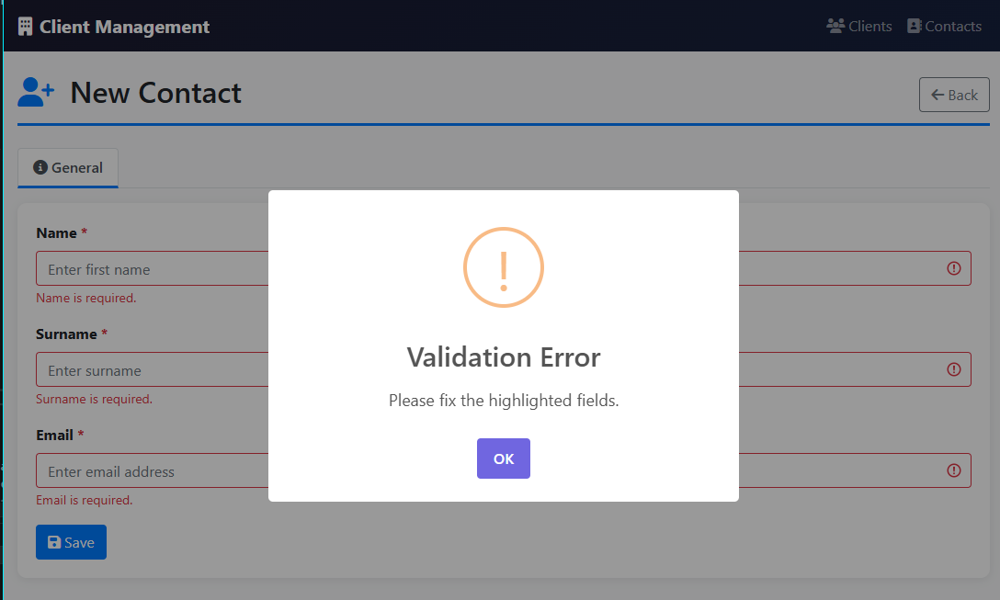

#### Edit Contact — Clients Tab (No Clients Linked)
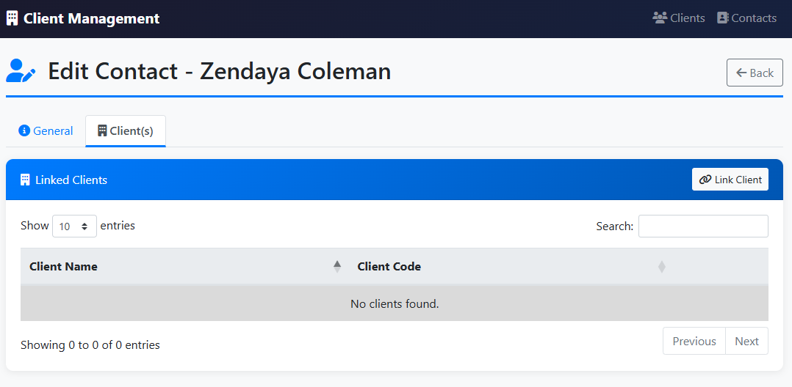

#### Delete Warning


#### Unlink Warning
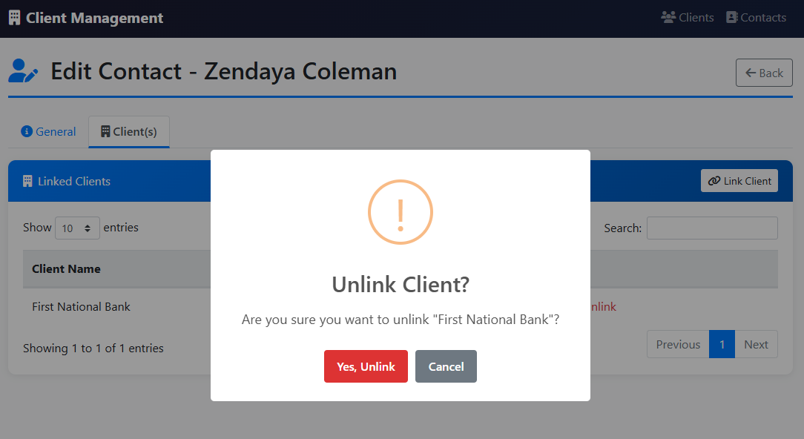

---

## ✨ Features

- Create, edit, and delete clients and contacts
- Link and unlink contacts to clients (many-to-many)
- Client code auto-generation — 3 alpha characters derived from the client name + 3 numeric digits (e.g. `FNB001`, `PRO123`)
- DataTables-powered lists with AJAX JSON endpoints — search, sort, and paginate without page reloads
- Tabbed forms separating General info from linked records
- Server-side validation (C# DataAnnotations + manual uniqueness checks)
- Client-side validation (JavaScript)
- SweetAlert2 dialogs for confirmations, success messages, and error feedback
- Repository pattern for clean separation of data access logic

---

## 🛠️ Tech Stack

| Layer | Technology |
|---|---|
| Language | C# |
| Framework | ASP.NET MVC 5 (.NET Framework 4.7.2) |
| Data Access | Dapper |
| Database | SQL Server (Express or full) |
| Frontend | Bootstrap 4, jQuery |
| Tables | DataTables 1.13.6 |
| Alerts | SweetAlert2 |
| Icons | Font Awesome 6 |
| Architecture | Repository Pattern + MVC |

---

## 🚀 Getting Started

### Prerequisites

- Visual Studio 2022
- .NET Framework 4.7.2
- SQL Server (Express or full)
- Git and a GitHub account (optional)

### Setup

1. **Clone the repository**
```bash
   git clone <repo-url>
```

2. **Open the solution**
   Open `Client Connect.sln` in Visual Studio 2022.

3. **Restore NuGet packages**
   Visual Studio should restore automatically. If not, open
   **Tools → NuGet Package Manager → Package Manager Console** and run:
```
   Install-Package Dapper
   Install-Package System.Data.SqlClient
```

4. **Run the database script**
   - Open SSMS
   - Run `DatabaseSetup.sql` from the root of the project
   - This creates the database, tables, indexes, and constraints

5. **Configure the connection string**
   Edit `Web.config` and update the `ClientManagementDB` connection string
   to point to your SQL Server instance:
```xml
   <add name="ClientManagementDB"
        connectionString="Server=YOUR_SERVER;Database=ClientManagementDB;Integrated Security=True;"
        providerName="System.Data.SqlClient" />
```

6. **Build and run**
   - **Build → Rebuild Solution**
   - Press **F5** or click **Start** (IIS Express)

---

## 📁 Project Structure
```
Client Connect/
├── Controllers/
│   ├── ClientsController.cs
│   └── ContactsController.cs
├── Models/
│   ├── Client.cs
│   ├── Contact.cs
│   ├── LinkedClient.cs
│   └── LinkedContact.cs
├── ViewModels/
│   ├── ClientFormViewModel.cs
│   └── ContactFormViewModel.cs
├── Repositories/
│   ├── IClientRepository.cs
│   ├── ClientRepository.cs
│   ├── IContactRepository.cs
│   └── ContactRepository.cs
├── Services/
│   └── ClientCodeService.cs
├── Views/
│   ├── Clients/
│   └── Contacts/
├── docs/
│   └── images/
├── DatabaseSetup.sql
└── Web.config
```

---

## 👤 Author

**Moleboheng**

---
